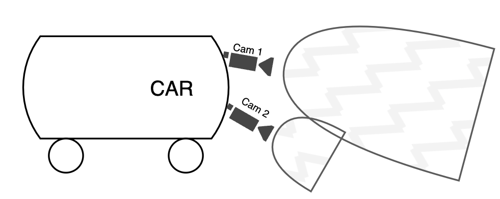
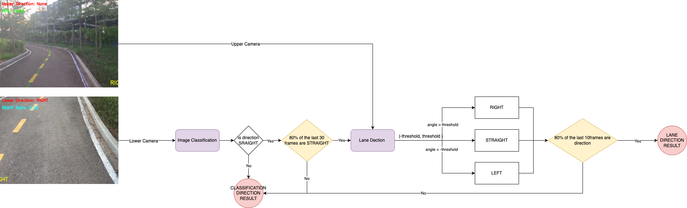

# 🚗 **Autonomous Car - Dual Camera ONNX Models**  

## 📌 **Models Used**  

- **Ultra-Fast-Lane-Detection V1** → *Camera 1*  
- **ResNet18 (Backbone ImageNet)** → *Camera 2*  

📥 **Download Models:**  
[Google Drive - Model Files](https://drive.google.com/drive/folders/1vAAf1BOgRfjUqCCjFBnpJsnCcyH7CfnR?usp=sharing)  

---

## 📂 **Model Setup**  

| **Model File**                  | **Destination Folder**         |
|----------------------------------|--------------------------------|
| `model_16.onnx`                 | `classification/models/`       |
| `tusimple_18_V1_fp32.onnx`      | `ultrafast/models/`            |

---

## 📸 **Camera Setup**  
📷 **Reference Image:**  
  

---

## 🔄 **Processing Flow**  
🛠 **Pipeline Overview:**  
  

---

## 🚀 **Installation & Setup**  

### 1️⃣ **Clone Repository**  

```bash
git clone https://github.com/abaoxomtieu/Autonomous-Car-2-Camera-ONNX.git
cd Autonomous-Car-2-Camera-ONNX
```

### 2️⃣ **Install Dependencies**  

```bash
pip install -r requirements.txt
```

---

## 🎥 **Input & Output**  

- **🖼 Input:** Frames from 2 cameras  
- **📌 Output:** Direction prediction → **STRAIGHT, LEFT, RIGHT**  

---